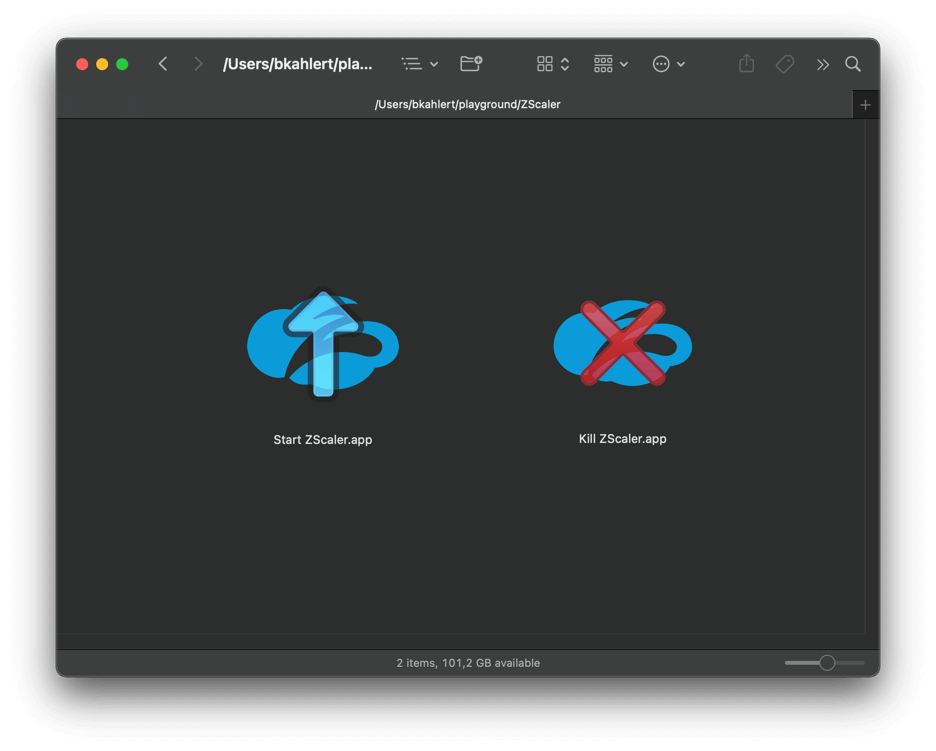

# Kill Zscaler for macOS

A simple utility to control Zscaler VPN service on macOS. This tool provides easy ways to stop and start Zscaler when needed.

## Features

- Simple GUI application to stop/start Zscaler
- Shell scripts for command-line control
- VPN tunnel sharing capability
- Support for shell aliases

## Using the App

The easiest way to use this tool is through the GUI applications:

1. Download and extract this repository
2. Use `Kill Zscaler.app` to stop Zscaler
3. Use `Start Zscaler.app` to restart Zscaler



## Command Line Usage

1. Clone the repository:
   ```bash
   git clone https://github.com/nicholasg-dev/kill-zscaler.git
   cd kill-zscaler
   ```

2. Make the scripts executable:
   ```bash
   chmod +x kill-zscaler.sh start-zscaler.sh
   ```

3. Run the scripts:
   ```bash
   ./kill-zscaler.sh  # To stop Zscaler
   ./start-zscaler.sh # To start Zscaler
   ```

## Shell Aliases

For quick access, you can set up shell aliases:

1. Open your shell's configuration file:
   - For Bash: `~/.bashrc`
   - For ZSH: `~/.zshrc`

2. Add these aliases:
   ```bash
   # Start Zscaler
   alias start-zscaler="open -a /Applications/Zscaler/Zscaler.app --hide; sudo find /Library/LaunchDaemons -name '*zscaler*' -exec launchctl load {} \;"
   
   # Stop Zscaler
   alias kill-zscaler="find /Library/LaunchAgents -name '*zscaler*' -exec launchctl unload {} \;;sudo find /Library/LaunchDaemons -name '*zscaler*' -exec launchctl unload {} \;"
   ```

3. Reload your shell configuration:
   ```bash
   source ~/.bashrc  # For Bash
   source ~/.zshrc   # For ZSH
   ```
